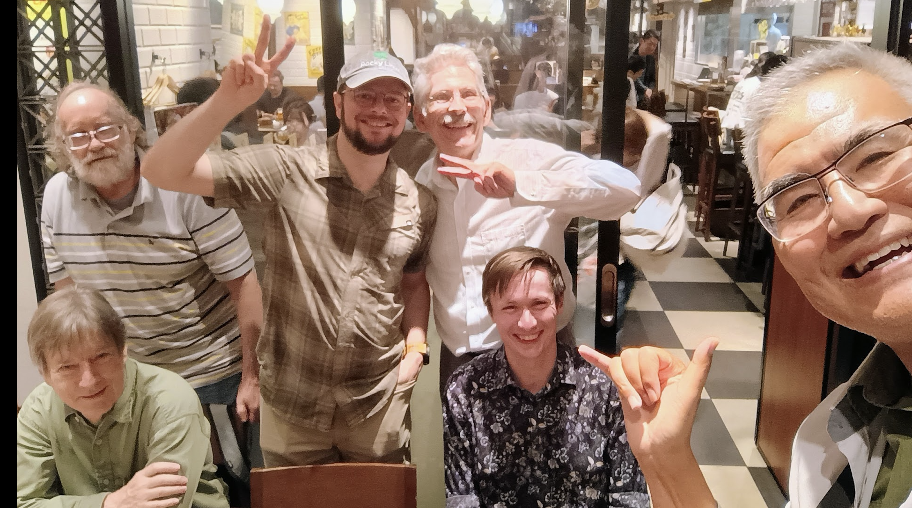
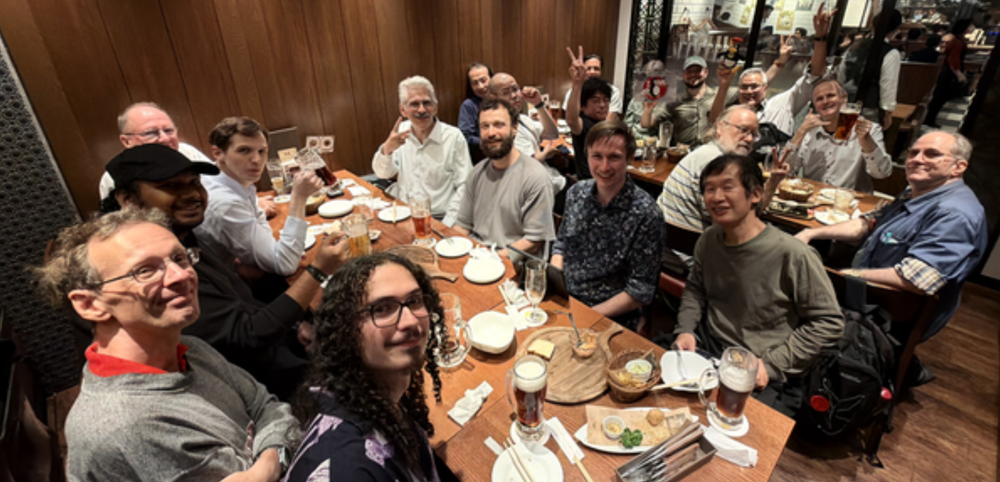
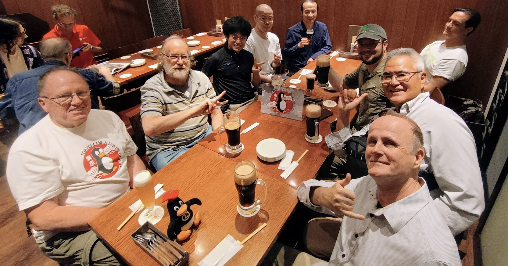
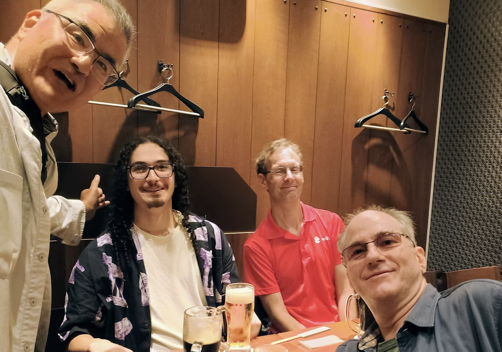

Innovation was thick in the air.  You breathed in and there it was. A new idea. A new company.
A new project to solve a problem that would change the world.

I had been here 30 years ago. The vibe was the same.  A disdain for the old inefficient ways, a
certain cockiness, a hint of arrogance that normal people could build something cool.
Three decades ago, a young group of TLUGers defied convention and started companies
and projects. They changed the world. In 2026, people are still working on amazing things
and fixing the problems of the world.

At every sip,or gulp, of beer, it felt like a revolution was about to take off.

Small discussions turned into big ideas.

- Emacs versus vi in 2026.  Why people still use vim on the local desktop
- How to create and maintain one of the world most widely  used Linux distributions in the world. Contribute
  to societal good, have fun, and get paid to help the world.
- Linguistic theory impact on AI
- Graph theory in the pharmaceutical industry
- Bayesian inference versus language models

After the 2nd dai-jouki (large beer mug), the nostalgic tales of the past
came up.  We discussed:

- how to start an open source company in Japan, solve a Japan-specific problem, take the solution global and raise $96M in venture funding
- organize information on Japan-specific Linux problems into a book for O'Reilly and have fun learning and teaching
- going from dial-up modems as a child to building a binary Linux distribution that would impact the world

I also met exchange students who are on their first steps of a marvelous adventure
with Linux in Japan.

Three of us at the table, had started our journey as exchange students at Sophia
University.

By the end of the night, everything felt good in the world.  Yes, the beer, pizza, and sausages
contributed to the warm feeling about the future of the world.  But much more than
that, I was reminded that is the connection between people that makes an impact on the world.
Linux and open source started with one person feeling annoyed at a problem they personally
encountered and they solved the problem for themselves.

Some people took the next step and published their software as open source,
not for fame or money.  People just
felt that the solution could be useful to other people. The desire to help people
is what keeps us together.  Despite the problems with potential negative
comments and support time-sinks, people around the world still have the courage
and will to release their software to the world

The next [TLUG](https://tlug.jp) meeting is on July 11, 2026. Sign up
on [Connpass](https://tlug.connpass.com/).

---

More pictures

